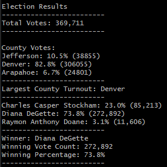

# Election_Analysis
### A Review of a States Popularity contest

## Project Overview
Tom, wanting to impress his bosses at the Colorado board of elections, enlisted me to put together a report of the previous election results.  I feel that Tom bosses might be better impressed with a full analysis of Colorado's Voter habits, and not just a small sample of just 3 counties.  But that is just my opinion don't count it as fact unless of course they really were not impressed with just 3 counties worth of data.

## Election Audit Results
Using Python we were able to calculate the following results of the election,  however keep in mind this data is skewed since it does not include all counties in Colorado.
### In Text
```
Election Results
-------------------------
Total Votes: 369,711
-------------------------

County Votes:
Jefferson: 10.5% (38855)
Denver: 82.8% (306055)
Arapahoe: 6.7% (24801)
-------------------------
Largest County Turnout: Denver
-------------------------
Charles Casper Stockham: 23.0% (85,213)
Diana DeGette: 73.8% (272,892)
Raymon Anthony Doane: 3.1% (11,606)
-------------------------
Winner: Diana DeGette
Winning Vote Count: 272,892
Winning Percentage: 73.8%
-------------------------
```
### A nice image of it.



### maybe just go to the output file
[election_results.txt](analysis/election_results.txt)

## Election Audit Summary
### About the Present!
From the output I created using a computer, you can clearly see that Diana is loved by all. Having taking 73% of the votes, Raymon and Charles clearly didn't stand a chance.  Diana must throw one heck of a party to have that much popularity, Maybe Raymon should have bribed ALL of Denver county with free massages and tacos.
### For the Future!
This script can definitely be updated to allow for any election.  It is already built to allow more candidates and counties than were present in the dataset. However if the election type changes, say Who is the best cook in the office?. The changing the output to match would be necessary.  

If the election is not the popularity contest and is instead based on who won the most counties, then a small change in the logic of the calculations could accomodate that. This would mean declaring more variables for county winner and a count of how many counties each candidate has won.  Likely some more logical tests to step through and determine voter count by county.
